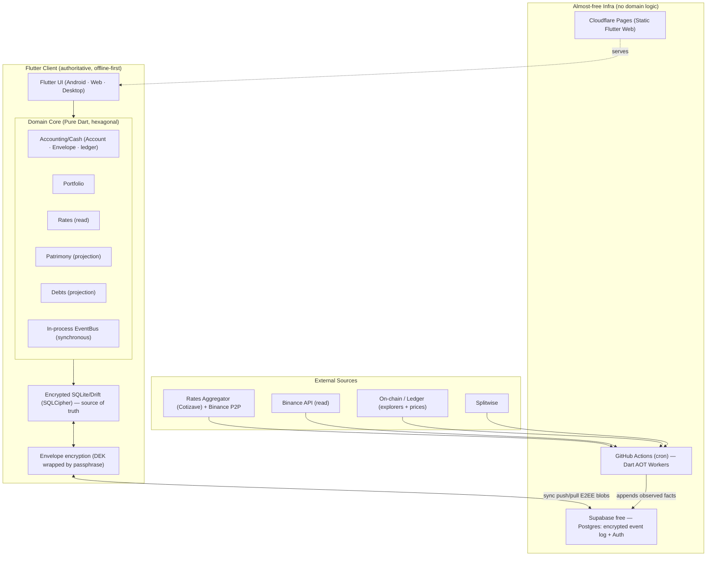

# Cuentaria — Solution Architecture

> Consolidated view of the architecture. Ties `docs/adr/` decisions to the domain model. Vocabulary is in [`docs/CONTEXT.md`](CONTEXT.md).

## 1. Executive Summary

Cuentaria is a **client-authoritative, offline-first** app built with **Flutter** (Android, Web, Windows/macOS/Linux) and a **pure Dart domain core** (hexagonal · DDD · CQRS · event sourcing). It is a **modular monolith** whose bounded contexts are Dart packages with explicit boundaries, **ready to hoist modules to microservices** without rewriting. Infrastructure aims to be **almost free**: Supabase free for sync/backup, GitHub Actions as workers cron, Cloudflare Pages for web. Data travels **end-to-end encrypted**; the user owns their info and can export it without lock-in.

Root decision: the domain **does not** live on a server or in Supabase-as-backend; it lives on the client. The "backend" is reduced to sync storage (opaque blobs) + scheduled fetchers. This makes offline natural, cost minimal, and E2EE almost free.

## 2. Component Diagram



## 3. Hexagonal Layers (inside each context)

`domain/` (aggregates, events, value objects, **ports**) → `application/` (command/query handlers) → `infrastructure/` (adapters: Drift, Supabase, APIs). The domain does not know Supabase or Flutter; they are adapters behind ports. Strict dependency inversion.

## 4. Modules Map (bounded contexts)

| Context | Role | Aggregates |
|----------|-----|-----------|
| **Accounting / Cash** | Write core: Account, Envelope, event log, all transaction types | Yes |
| **Rates** | Transversal: series of observed facts (BCV, parallel); read-model per port | No |
| **Portfolio** | Holdings, L1 valuation, passive income; data ready for L2 | Yes |
| **Patrimony** | Read-only projection: "where the money is" + net worth | No |
| **Debts** | Read-only projection: balance per person on receivable/payable accounts | No |

Communication between modules: **only** domain events (synchronous in-process EventBus) + application API; references **by ID**; forbidden to import another's `domain/`. Splitting into microservices = changing the in-process bus for a network one.

## 5. Key Flows

**Offline capture → sync.** User records a transaction → aggregate validates invariants (including auto-balanced rule `Σ usd[Account] == Σ usd[Envelope]`) → emits events → persisted in local encrypted SQLite → when network is available, envelope-encrypted and pushed to Supabase. Multi-device: pull + merge by event order (safe because each transaction preserves the invariant).

**Rates.** Worker on GitHub Actions (2–3×/day) queries aggregator (Binance direct fallback) → appends observations to series in Supabase → client pulls them → feed the **valuation overlay** and differential reports. The ledger remains at **real cost**.

**Reconciliation.** Real balance (declared or via API) vs ledger; within configurable tolerance = one touch; outside = review. Adjustment brings ledger to real with a self-balanced event (Account + "Adjustments" Envelope).

## 6. Tech Stack

| Layer | Choice | Note |
|------|----------|------|
| Client / UI | **Flutter** (Android, Web, Windows/macOS/Linux) | iOS later |
| Language | **Dart** everywhere (core + workers) | Single language |
| Local store | **SQLite / Drift + SQLCipher** | Source of truth, encrypted |
| Sync/backup/Auth | **Supabase free** (Postgres + Auth + RLS) | Only stores E2EE blobs; no logic |
| Workers | **Dart AOT** on **GitHub Actions** (cron) | Deferred scale-to-zero Cloud Run |
| Web hosting | **Cloudflare Pages** | Static |
| Encryption | **Envelope E2EE** (DEK + passphrase + recovery code) | Argon2id; `cryptography`/`sodium` |
| Rates | **Aggregator (Cotizave)** + Binance P2P fallback | Append-only series |
| ~~Vercel · Clerk~~ | **Discarded** | Don't earn their place (ADR-0004 / ADR-0009) |

## 7. Monorepo Structure (F1 goal)

```
cuentaria/
├── melos.yaml
├── pubspec.yaml                 # workspace
├── apps/
│   └── cuentaria_app/           # Flutter (Android · Web · Desktop)
├── packages/
│   ├── shared_kernel/           # pure value objects (Money, Rate, IDs)
│   ├── event_bus/               # In-process EventBus
│   ├── contabilidad/            # C1 — domain/application/infrastructure
│   ├── tasas/                   # S1
│   ├── portafolio/              # S4
│   ├── patrimonio/              # S2 (projection)
│   └── deudas/                  # S3 (projection)
├── workers/                     # Dart AOT (rates ingestion, I1 integrations)
├── docs/
│   ├── CONTEXT.md
│   ├── ARCHITECTURE.md
│   └── adr/
├── AGENTS.md
└── README.md
```

## 8. Decision Index (ADRs)

See [`docs/adr/`](adr/README.md). One-line summary for each:

- **ADR-0001** — Client-authoritative, offline-first domain.
- **ADR-0002** — Append-only everywhere; two event archetypes (domain vs observed fact).
- **ADR-0003** — Dart everywhere, including workers (AOT, scale-to-zero).
- **ADR-0004** — Almost-free hosting: Supabase free + GitHub Actions + Cloudflare Pages; Vercel out.
- **ADR-0005** — Modular monolith: structure, event integration, context map.
- **ADR-0006** — Account × Envelope Ledger: independent dimensions, self-balancing transaction, real cost + valuation overlay.
- **ADR-0007** — Rates Service: canonical Binance P2P, multi-source, aggregator ingestion.
- **ADR-0008** — Integrations: observed facts propose reconciliation, never write to the ledger.
- **ADR-0009** — Security: Envelope E2EE, Supabase Auth, local encryption, export without lock-in.
- **ADR-0010** — Unified model for Envelope targets/contributions.
- **ADR-0011** — Operational reconciliation: configurable tolerance governs friction.

## 9. The 9 Model Rules (how they materialize)

1. Two dimensions: **Account** (where) × **Envelope** (what for); always reconcile → ADR-0006.
2. Base currency **USD**, multi-currency; transactional VES → ADR-0006.
3. Money **never leaves the system**, only moves → invariant in each transaction.
4. **Real cost** as truth; optional BCV value → USD snapshot + overlay (ADR-0006).
5. **Polymorphic providers**; sync is an optional capability → ADR-0008.
6. **Honest automation**: fewer actions, not zero → ADR-0008/0011.
7. **Distributing = moving tags**, automatic and instant → ADR-0010.
8. **Reconciliation** as a recurring ritual → ADR-0011.
9. **Own data**, exportable, no lock-in → ADR-0009 (NDJSON export).

## 10. Open / Deferred

- **Fast capture UX (U1):** quick-add, templates, shortcuts, P2P flow — product session.
- **Named distribution templates** ("normal month", "lean month", "bonus").
- **Level 2 Portfolio** (PNL/cost basis per lot) — data already prepared.
- **Assets + depreciation**; **native splitting** (Splitwise replacement) → would promote Debts to write context.
- **Cloud Run** if on-demand need arises (PayPal OAuth callback, "refresh now").
