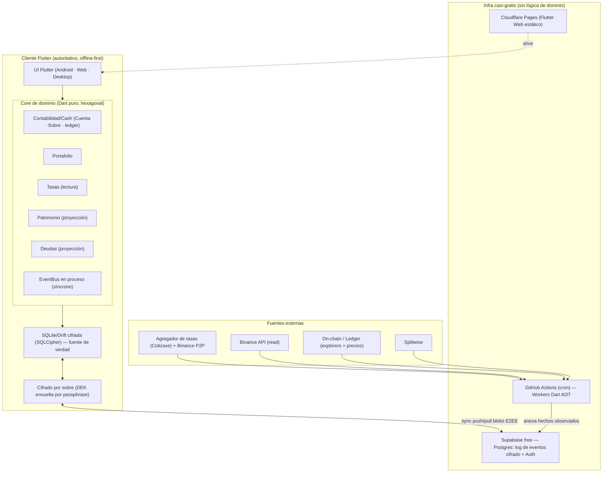

# Cuentaria — Arquitectura de la Solución

> Vista consolidada de la arquitectura. Ata las decisiones de `docs/adr/` al modelo de
> dominio. El vocabulario está en [`docs/CONTEXT.md`](CONTEXT.md).

## 1. Resumen ejecutivo

Cuentaria es una app **cliente-autoritativa, offline-first**, construida con **Flutter**
(Android, Web, Windows/macOS/Linux) y un **core de dominio en Dart puro** (hexagonal · DDD ·
CQRS · event sourcing). Es un **monolito modular** cuyos bounded contexts son paquetes Dart con
fronteras explícitas, **listo para izar módulos a microservicios** sin reescritura. La
infraestructura busca ser **casi gratis**: Supabase free como sync/backup, GitHub Actions como
cron de los workers, Cloudflare Pages para la web. Los datos viajan **cifrados
extremo-a-extremo**; el usuario es dueño de su información y puede exportarla sin lock-in.

Decisión raíz: el dominio **no** vive en un servidor ni en Supabase-as-backend; vive en el
cliente. El "backend" se reduce a almacenamiento de sync (blobs opacos) + fetchers programados.
Esto hace el offline natural, el costo mínimo, y el E2EE casi gratis.

## 2. Diagrama de componentes



## 3. Capas hexagonales (dentro de cada contexto)

`domain/` (agregados, eventos, value objects, **puertos**) → `application/` (handlers de
comando/query) → `infrastructure/` (adaptadores: Drift, Supabase, APIs). El dominio no conoce a
Supabase ni a Flutter; son adaptadores detrás de puertos. Inversión de dependencias estricta.

## 4. Mapa de módulos (bounded contexts)

| Contexto | Rol | Agregados |
|----------|-----|-----------|
| **Contabilidad / Cash** | Núcleo write: Cuenta, Sobre, log de eventos, todos los tipos de transacción | Sí |
| **Tasas** | Transversal: serie de hechos observados (BCV, paralelo); read-model por puerto | No |
| **Portafolio** | Holdings, valoración N1, ingresos pasivos; datos listos para N2 | Sí |
| **Patrimonio** | Proyección de solo-lectura: "dónde está el dinero" + patrimonio neto | No |
| **Deudas** | Proyección de solo-lectura: balance por persona sobre cuentas por cobrar/pagar | No |

Comunicación entre módulos: **solo** eventos de dominio (EventBus síncrono en proceso) + API de
aplicación; referencias **por ID**; prohibido importar el `domain/` ajeno. Partir a
microservicios = cambiar el bus en-proceso por uno de red.

## 5. Flujos clave

**Captura offline → sync.** El usuario registra una transacción → el agregado valida
invariantes (incluida la regla auto-balanceada `Σ usd[Cuenta] == Σ usd[Sobre]`) → emite eventos
→ se persisten en la SQLite local cifrada → al haber red, se cifran por sobre y se hacen push a
Supabase. Multi-dispositivo: pull + merge por orden de eventos (seguro porque cada transacción
preserva el invariante).

**Tasas.** Worker en GitHub Actions (2–3×/día) consulta el agregador (fallback Binance directo)
→ anexa observaciones a la serie en Supabase → el cliente las baja → alimentan el **overlay de
valoración** y reportes de diferencial. El ledger permanece a **costo real**.

**Conciliación.** Saldo real (declarado o vía API) vs ledger; dentro de tolerancia configurable
= un toque; fuera = revisión. El ajuste lleva el ledger al real con un evento auto-balanceado
(Cuenta + Sobre "Ajustes").

## 6. Stack tecnológico

| Capa | Elección | Nota |
|------|----------|------|
| Cliente / UI | **Flutter** (Android, Web, Windows/macOS/Linux) | iOS más adelante |
| Lenguaje | **Dart** en todo (core + workers) | Un solo lenguaje |
| Store local | **SQLite / Drift + SQLCipher** | Fuente de verdad, cifrada |
| Sync / backup / Auth | **Supabase free** (Postgres + Auth + RLS) | Solo almacena blobs E2EE; sin lógica |
| Workers | **Dart AOT** en **GitHub Actions** (cron) | Cloud Run scale-to-zero diferido |
| Web hosting | **Cloudflare Pages** | Estático |
| Cifrado | **E2EE por sobre** (DEK + passphrase + código de recuperación) | Argon2id; `cryptography`/`sodium` |
| Tasas | **Agregador (Cotizave)** + Binance P2P fallback | Serie append-only |
| ~~Vercel · Clerk~~ | **Descartados** | No se ganan su lugar (ADR-0004 / ADR-0009) |

## 7. Estructura del monorepo (objetivo F1)

```
cuentaria/
├── melos.yaml
├── pubspec.yaml                 # workspace
├── apps/
│   └── cuentaria_app/           # Flutter (Android · Web · Desktop)
├── packages/
│   ├── shared_kernel/           # value objects puros (Money, Tasa, IDs)
│   ├── event_bus/               # EventBus en proceso
│   ├── contabilidad/            # C1 — domain/application/infrastructure
│   ├── tasas/                   # S1
│   ├── portafolio/              # S4
│   ├── patrimonio/              # S2 (proyección)
│   └── deudas/                  # S3 (proyección)
├── workers/                     # Dart AOT (ingesta tasas, integraciones I1)
├── docs/
│   ├── CONTEXT.md
│   ├── ARCHITECTURE.md
│   └── adr/
├── CLAUDE.md
└── README.md
```

## 8. Índice de decisiones (ADRs)

Ver [`docs/adr/`](adr/README.md). Resumen en una línea cada una:

- **ADR-0001** — Dominio cliente-autoritativo, offline-first.
- **ADR-0002** — Append-only en todo; dos arquetipos de evento (dominio vs hecho observado).
- **ADR-0003** — Dart en todo, incluidos los workers (AOT, scale-to-zero).
- **ADR-0004** — Hosting casi-gratis: Supabase free + GitHub Actions + Cloudflare Pages; Vercel fuera.
- **ADR-0005** — Monolito modular: estructura, integración por eventos, mapa de contextos.
- **ADR-0006** — Ledger Cuenta × Sobre: dimensiones independientes, transacción auto-balanceada, costo real + valoración overlay.
- **ADR-0007** — Servicio de Tasas: Binance P2P canónico, multi-fuente, ingesta vía agregador.
- **ADR-0008** — Integraciones: lo observado propone conciliación, nunca escribe al ledger.
- **ADR-0009** — Seguridad: E2EE por sobre, Supabase Auth, cifrado local, export sin lock-in.
- **ADR-0010** — Modelo unificado de metas/aportes de Sobres.
- **ADR-0011** — Conciliación operativa: la tolerancia configurable gobierna la fricción.

## 9. Las 9 reglas del modelo (cómo se materializan)

1. Dos dimensiones: **Cuenta** (dónde) × **Sobre** (para qué); siempre concilian → ADR-0006.
2. Moneda base **USD**, multi-moneda; Bs transaccional → ADR-0006.
3. El dinero **nunca sale del sistema**, solo se mueve → invariante en cada transacción.
4. **Costo real** como verdad; valor BCV opcional → snapshot USD + overlay (ADR-0006).
5. **Proveedores polimórficos**; sync es capacidad opcional → ADR-0008.
6. **Automatización honesta**: menos acciones, no cero → ADR-0008/0011.
7. **Distribuir = mover etiquetas**, automático e instantáneo → ADR-0010.
8. **Conciliación** como ritual recurrente → ADR-0011.
9. **Datos propios**, exportables, sin lock-in → ADR-0009 (export NDJSON).

## 10. Abierto / diferido

- **UX de captura rápida (U1):** quick-add, plantillas, atajos, flujo P2P — sesión de producto.
- **Plantillas de distribución con nombre** ("mes normal", "mes flaco", "bono").
- **Portafolio Nivel 2** (PNL/cost basis por lote) — datos ya preparados.
- **Activos + depreciación**; **splitting nativo** (reemplazo de Splitwise) → promovería Deudas a contexto write.
- **Cloud Run** si aparece necesidad on-demand (callback OAuth PayPal, "refrescar ya").
